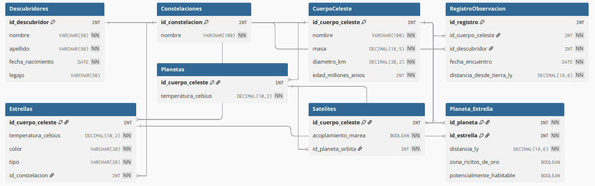
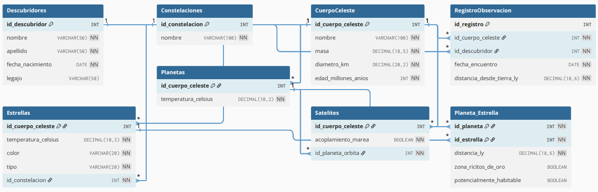

# Documentación DDL: Estructura de Datos (ObservatorioDB_Grupo_1)

Este documento detalla el esquema de la base de datos `ObservatorioDB_Grupo_1`. El diseño utiliza un patrón de **"Tabla por Tipo"** para manejar la herencia de los cuerpos celestes, donde una tabla padre (`CuerpoCeleste`) almacena los atributos comunes y las tablas hijas (`Estrellas`, `Planetas`, `Satelites`) almacenan los atributos específicos.

## 1. Configuración Inicial
Se crea la base de datos `ObservatorioDB_Grupo_1` (si no existe) y se selecciona para su uso inmediato.

## 2. Tablas de Soporte (Entidades Independientes)

Estas tablas almacenan información que no depende de la jerarquía física de los objetos, pero que es fundamental para la clasificación y el registro histórico.

### `Descubridores`
Almacena la información de las personas o entidades responsables de los hallazgos astronómicos.

| Columna | Tipo de Dato | Restricciones | Descripción |
| :--- | :--- | :--- | :--- |
| **id_descubridor** | `INT` | `PK`, `AUTO_INCREMENT` | Identificador único del descubridor. |
| **nombre** | `VARCHAR(50)` | `NOT NULL` | Nombre de pila. |
| **apellido** | `VARCHAR(50)` | `NOT NULL` | Apellido. |
| **fecha_nacimiento** | `DATE` | `NOT NULL` | Fecha de nacimiento. |
| **legajo** | `VARCHAR(50)` | `NULL` | Código interno de empleado (opcional). |

### `Constelaciones`
Catálogo de agrupaciones estelares utilizadas para ubicar estrellas en el cielo nocturno.

| Columna | Tipo de Dato | Restricciones | Descripción |
| :--- | :--- | :--- | :--- |
| **id_constelacion** | `INT` | `PK`, `AUTO_INCREMENT` | Identificador único. |
| **nombre** | `VARCHAR(100)` | `NOT NULL`, `UNIQUE` | Nombre oficial (ej. "Orión", "Andrómeda"). |

---

## 3. Jerarquía de Cuerpos Celestes (Núcleo del Modelo)

Esta sección define la estructura principal. Todos los objetos físicos heredan de una Clase.

### `CuerpoCeleste` (Clase)
Entidad padre que contiene los atributos físicos compartidos por cualquier objeto astronómico.

| Columna | Tipo de Dato | Restricciones | Descripción |
| :--- | :--- | :--- | :--- |
| **id_cuerpo_celeste** | `INT` | `PK`, `AUTO_INCREMENT` | ID Maestro. Referenciado por las tablas hijas. |
| **nombre** | `VARCHAR(100)` | `NOT NULL`, `UNIQUE` | Nombre único del objeto. |
| **masa** | `DECIMAL(18, 5)` | `NOT NULL` | Masa del objeto. |
| **diametro_km** | `DECIMAL(20, 2)` | `NOT NULL` | Tamaño físico en kilómetros. |
| **edad_millones_anios**| `INT` | `NOT NULL` | Antigüedad estimada. |

### `Estrellas` (Subclase)
Extiende a `CuerpoCeleste`. Representa objetos que emiten luz propia.

| Columna | Tipo de Dato | Restricciones | Descripción |
| :--- | :--- | :--- | :--- |
| **id_cuerpo_celeste** | `INT` | `PK`, `FK` | Relación 1:1 con `CuerpoCeleste`. |
| **temperatura_celsius**| `DECIMAL(10, 2)`| `NOT NULL` | Temperatura superficial. |
| **color** | `VARCHAR(20)` | `CHECK(...)` | Limitado a: 'Roja', 'Naranja', 'Amarilla', 'Blanca', 'Azul'. |
| **tipo** | `VARCHAR(20)` | `CHECK(...)` | Limitado a: 'Enana', 'Gigante'. |
| **id_constelacion** | `INT` | `FK` | Relación con la tabla `Constelaciones`. |

### `Planetas` (Subclase)
Extiende a `CuerpoCeleste`. Objetos que orbitan estrellas.

| Columna | Tipo de Dato | Restricciones | Descripción |
| :--- | :--- | :--- | :--- |
| **id_cuerpo_celeste** | `INT` | `PK`, `FK` | Relación 1:1 con `CuerpoCeleste`. |
| **temperatura_celsius**| `DECIMAL(10, 2)`| `NOT NULL` | Temperatura promedio. |

### `Satelites` (Subclase)
Extiende a `CuerpoCeleste`. Lunas u objetos que orbitan planetas.

| Columna | Tipo de Dato | Restricciones | Descripción |
| :--- | :--- | :--- | :--- |
| **id_cuerpo_celeste** | `INT` | `PK`, `FK` | Relación 1:1 con `CuerpoCeleste`. |
| **acoplamiento_marea** | `BOOLEAN` | `NOT NULL` | Indica si siempre muestra la misma cara al planeta. |
| **id_planeta_orbita** | `INT` | `FK` | Relación con el `Planeta` anfitrión. |

---

## 4. Tablas de Relación y Transacciones

Definen cómo interactúan los objetos entre sí y con los observadores.

### `RegistroObservacion`
Historial de avistamientos. Vincula un descubridor con un cuerpo celeste en un momento específico.

* **Restricción Clave:** `UQ_Registro_Cuerpo_Fecha` asegura que no se pueda registrar el mismo cuerpo dos veces en la misma fecha.

| Columna | Tipo | Notas |
| :--- | :--- | :--- |
| **id_registro** | `INT` | PK Autoincremental. |
| **id_cuerpo_celeste** | `INT` | FK a la Clase `CuerpoCeleste`. |
| **id_descubridor** | `INT` | FK a `Descubridores`. |
| **fecha_encuentro** | `DATE` | Fecha del hallazgo. |
| **distancia_desde_tierra_ly** | `DECIMAL` | Distancia en Años Luz. |

### `Planeta_Estrella` (Sistema Planetario)
Tabla intermedia que define la órbita de un planeta alrededor de una estrella. Permite sistemas binarios (un planeta orbitando dos estrellas) al ser una relación N:M teórica, aunque físicamente se use para definir "a qué estrella pertenece este planeta".

| Columna | Tipo | Descripción |
| :--- | :--- | :--- |
| **id_planeta** | `INT` | Parte de la PK Compuesta (FK a `Planetas`). |
| **id_estrella** | `INT` | Parte de la PK Compuesta (FK a `Estrellas`). |
| **distancia_ly** | `DECIMAL` | Distancia entre el planeta y su estrella. |
| **zona_ricitos_de_oro** | `BOOLEAN` | ¿Está en zona habitable teórica? |
| **potencialmente_habitable**| `BOOLEAN` | ¿Tiene condiciones para la vida? |

## 5. Diagrama Entidad/Relación

---